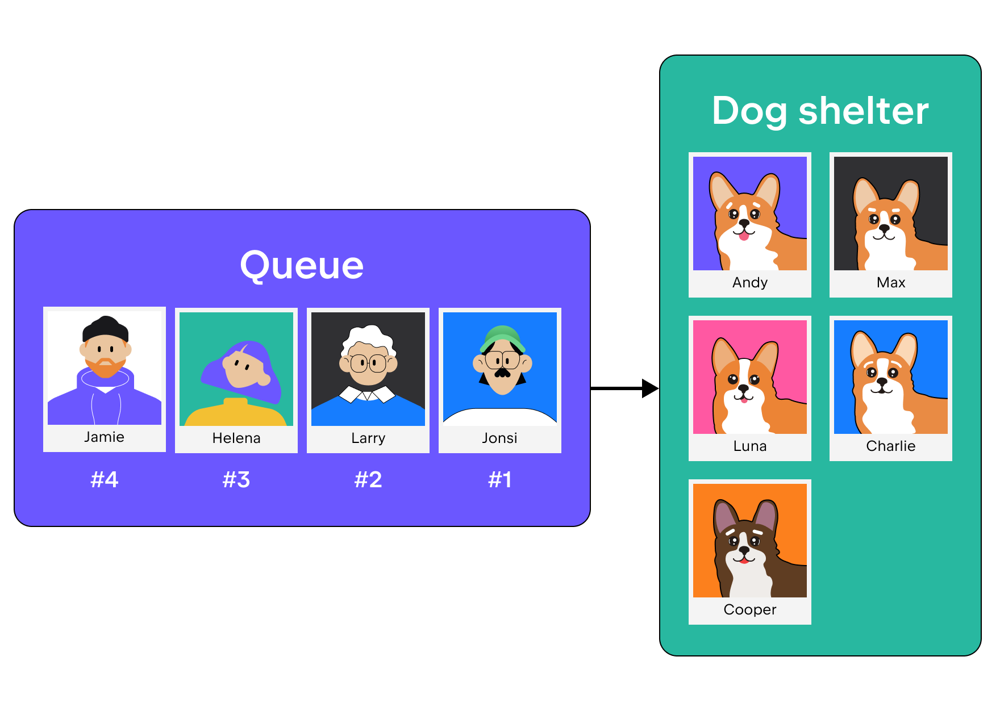

**FIFO** is an abbreviation for _first in, first out_. 
It is a method of handling data structures in which the first element 
is processed first and the most recent element is processed last.
This approach is often called a _queue_.

Consider an example.
Let's say you want to adopt a pet, so you go to a dog shelter. 
However, it turns out that you (character #4) are not the only one who wants a dog, 
and there is already a queue at the shelter. 
Therefore, you will be the last in line. 
In this case, _the first person in line gets to choose a dog first_. 
This means that in this case, you will wait for people #1, #2, #3 to take their dogs and then choose from what is left. 
This is the FIFO approach.

