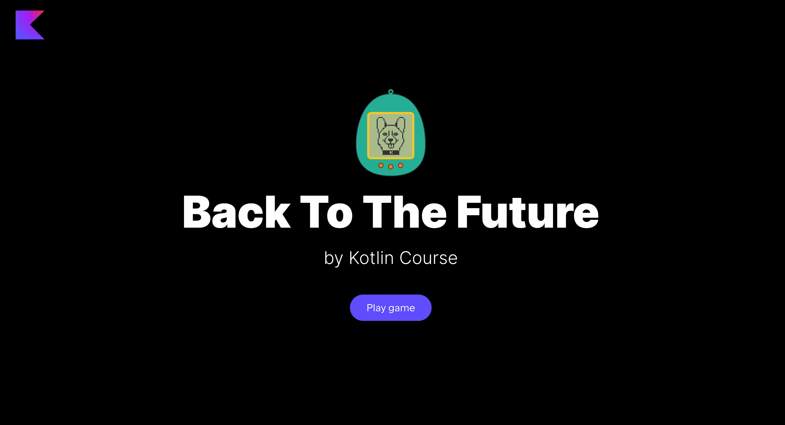

Thanks to this step, our application comes to life with the commands storage.
In this task, you need to implement the `getCommand` function in the already implemented `GameService`
class in the `org.jetbrains.kotlin.course.tamagotchi.game` package.

This function should return `null` if `commands` is empty. 
Otherwise, it should get a command from `commands` according to the `mode`.

After implementing this task, the commands storage will work properly.

If you have any difficulties, **hints will help you solve this task**.

----

### Hints

You can use the built-in functions [`removeFirstOrNull`](https://kotlinlang.org/api/latest/jvm/stdlib/kotlin.collections/-array-deque/remove-first-or-null.html) 
and [`removeLastOrNull`](https://kotlinlang.org/api/latest/jvm/stdlib/kotlin.collections/-array-deque/remove-last-or-null.html) 
to remove and return an element. Both these functions return `null` if the collection is empty.

