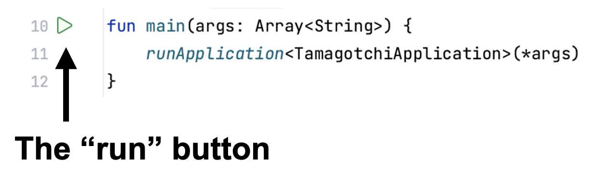
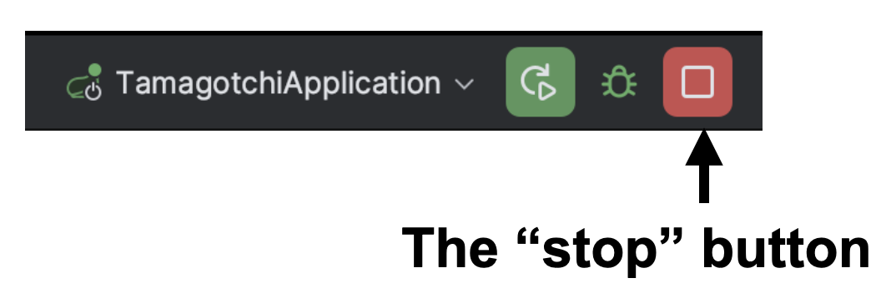
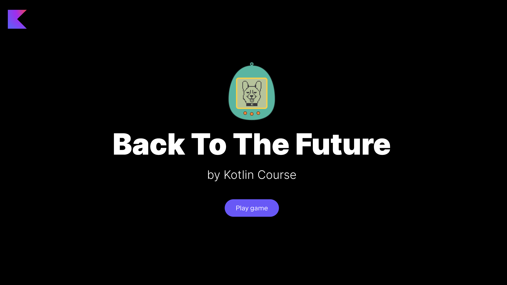

At each stage, you can run the current version of the application.
However, if some functionality is not yet ready,
then some buttons may not work and some information may not be displayed.

To run the application, you need to run the `main` function inside
the [TamagotchiApplication.kt](psi_element://org.jetbrains.kotlin.course.tamagotchi.TamagotchiApplicationKt#main) file:

Please don't forget to _stop all other runs_ by pressing the red square button:

Next, you need to open any browser (we recommend using [Google Chrome](https://www.google.com/chrome/) to display the elements as in the examples)
and open http://localhost:8080/. You will see the main page of the application.

If an application from a previous launch is displayed on the screen when starting the game, you need to reset the caches.
This can usually be done with a keyboard shortcut: `ctrl` + `shift` + `R` (`command` + `shift` + `R` for macOS).

