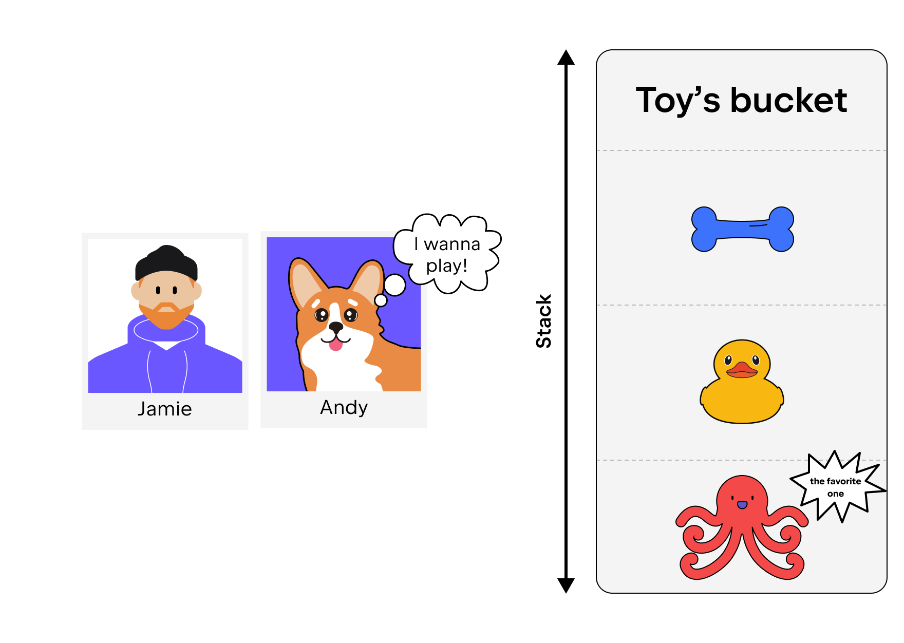

**LIFO** is an abbreviation for _last in, first out_.
It is a method of handling data structures in which the last element
is processed first and the first element is processed last.
This approach is often called a _stack_.

Consider an example.
Let's say you've adopted a dog and bought lots of toys. 
But everyone knows that corgis shed a lot and the house has to be cleaned often. 
When cleaning, you put all the toys in a special toy box 
(let's imagine that the toys can only be placed at different levels in the box). 
And now, when your dog asks you to play with its favourite toy—the octopus, 
which you accidentally put away first—you can get it last 
because you first have to get all the other toys, which you put in the basket later.
This is the LIFO approach.

