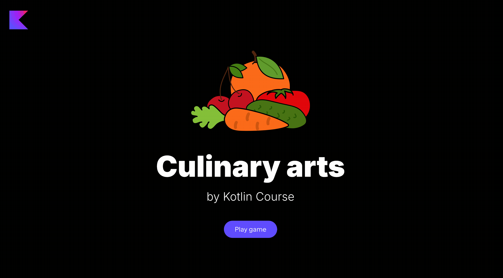

We have already learnt how to make a tomato soup, now it is time to make a vegetable salad and see the difference between list and sequence!
In this task we will make the `Salad list` button live.

**Note** that in this task the _set of available buttons in the application is different_. 
It only has buttons that are needed for this task.
This is the expected behaviour.

In this task, you need to implement three functions in the `Salad.kt` file:

- `getFreshVegetables` - which gets all vegetables from the fridge (see `FridgeImpl.getAllVegetables`) and returns only the fresh ones
- `cut` - that is an extension function a list of vegetables (from `getFreshVegetables` function) and prepare them for the salad:

    - put ech vegetable on the kitchen (see `KitchenImpl.put`)
    - cut each vegetable (see `KitchenImpl.cut`)
    - then take `NUM_VEGETABLES_FOR_SALAD` from the list
    - and finally take these vegetables from the kitchen (see `KitchenImpl.take`)

- `mixVegetablesForSalad` - which accepts a list of cut vegetables and cook them:
    
    - group by the vegetables by their types
    - and then each of them add to the salad bowl (see `SaladBowlImpl.add`)
    - finally, mix the vegetables (see `SaladBowlImpl.mix`)

<div class="hint" title="Click me to view the expected state of the application after completing this task">


</div>

You may have noticed that sometimes you have cut vegetables on the table.
That's because you used a _list_ to store them all, and each action was performed on each item in the list.
But in the end we only took some vegetables, enough for the salad.

If we change just one line of code in this code and use a _sequence_ instead of a _list_, the order will change automatically.
You can check this by pressing the `Salad seq.` button. 
If you want to check the implementation for this button, please check `GameService.kt` file, `cookSaladAsSequence` method.

The sequence behaviour:



If you have any difficulties, **hints will help you solve this task**.

----

### Hints

<div class="hint" title="Click me to learn how to use API functions">

The game has the `GameEnviroment.kt` file which contains _instances_ of all possible objects, e.g.
it has `kitchen` variable for `KitchenImpl` and to use `KitchenImpl` API you need to call it with `kitchen`:
```kotlin
kitchen.put(...)
```
</div>