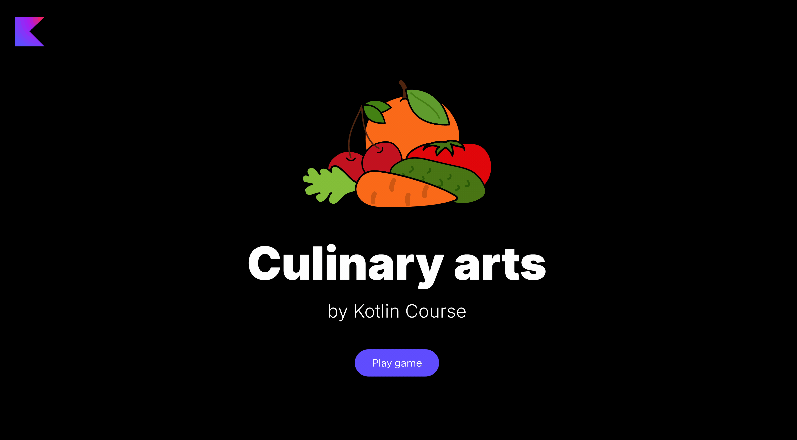

### Project description

The project of this lesson is **Master Chef**.
Have you ever dreamed of becoming a master chef?
In this application all your dreams will come true, and you will be able
to cook delicious dishes and learn programming. Isn't it great?

### Lesson topics

- Working with API
- List vs Sequence

### Project example

By the end of this task, you will create the following application:

**Tomato soup tasks:**

**Salad tasks:**

**Smoothie tasks:**

