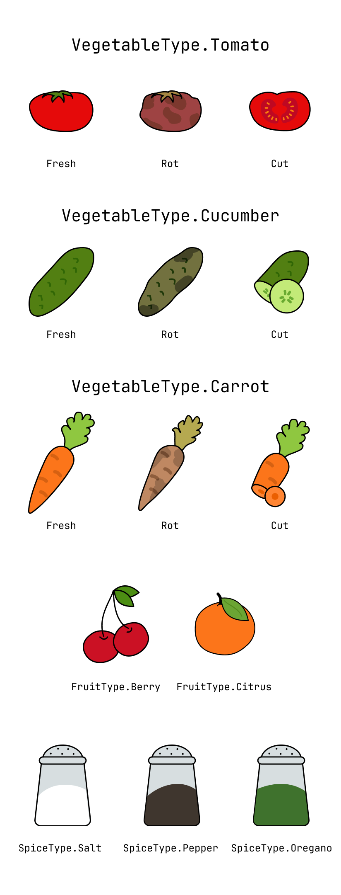
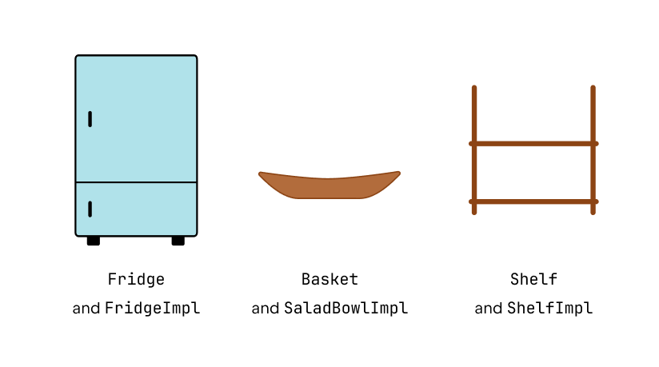
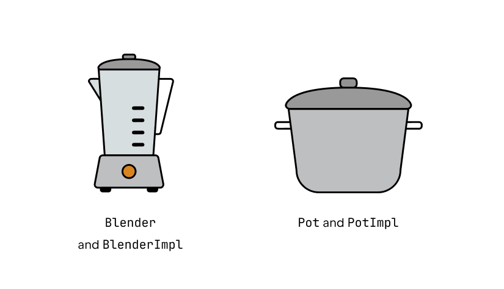

To work in our kitchen, you need to understand what API (classes and functions) we already have,
because throughout this lesson you will be improving that API.

Firstly, we have a set of _models_ which represent all the items in our kitchen.
All models are stored in the `models' folder and are divided into three categories:
- _food_ - models that represent all the possible foods we have.
- _storage_ - models representing places where food is stored, such as a fridge or a shelf.
- _cooking_ - models representing kitchen utensils for cooking, such as a pot.

Let's start with the _food_ models. Basically we have vegetables, fruits and species.
Vegetables can be fresh or not, cut or in their original form.
**Check all the possible models before going to the next steps,
it will help you when we refer to them in the tasks.**

Then we have the _storage_ models.
We only have three types of storage: a fridge that can only store vegetables,
a basket for storing fruit and a shelf for storing spices.
**Check all the possible models before going to the next steps,
it will help you when we refer to them in the tasks.**

Finally, we have the _cooking_ models.
These will help us to cook our dishes.
As you can see, they are implemented as interfaces,
and you will be implementing some of these functions yourself during this lesson.
**Check all the possible models before going to the next steps,
it will help you when we refer to them in the tasks.**

