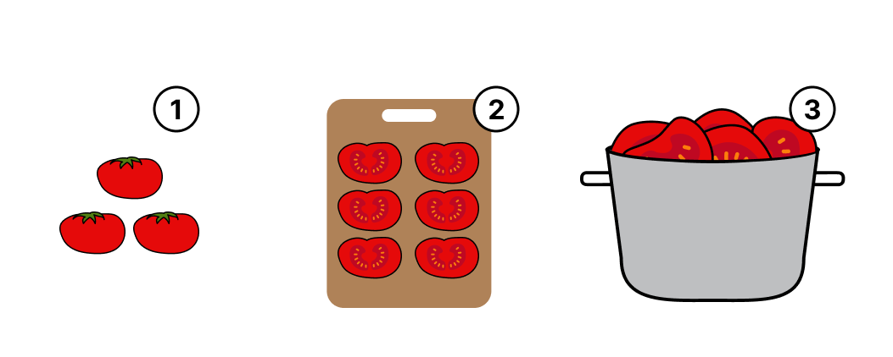
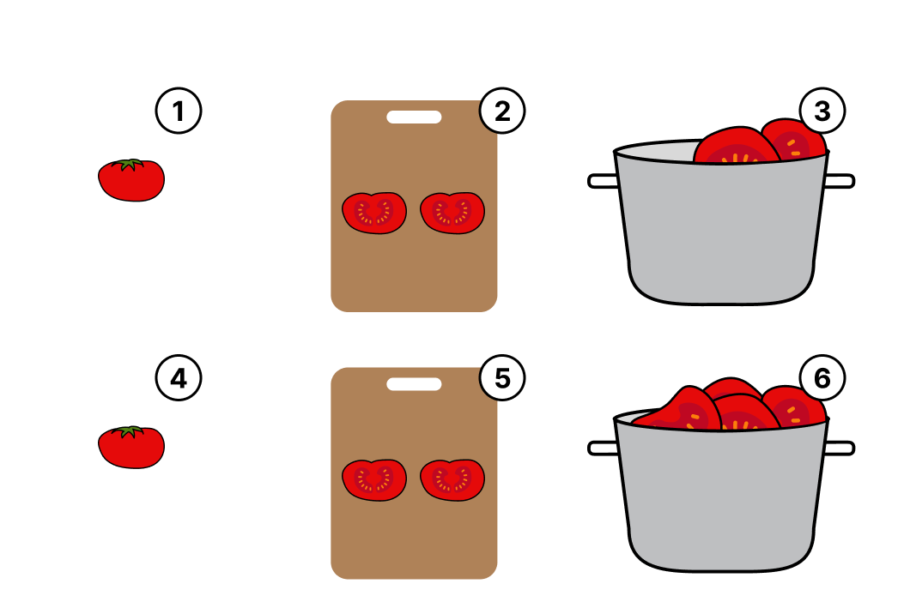
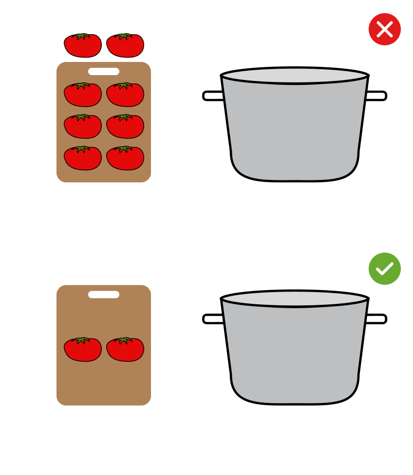

The main purpose of this project is to show the difference between regular collections
(in our example `List`) with `Sequence`s.
**If you are not familiar with Kotlin collections, we recommend you to learn them with the previous projects on this course and come back then.**

Unlike collections, sequences _don't contain elements_, they produce them while iterating.
Sequences implement the approach to multi-step collection processing.
It means, that when you operate with sequences you combine all the operations that should be done in one action.

Consider an example with cooking.
Let's imagine that we need to cook a tomato soup.
To make it simple, we will use only tomatoes.
To cook this soup, we need to pull tomatoes from the fridge, put them into the kitchen, cut them, and then add into a pot.

If we work with a _list_ of tomatoes, then we will do it exactly as we described,
since we will be working with all the tomatoes per action, e.g., get all tomatoes, then cut all the tomatoes, etc:

If we work with a _sequence_ of tomatoes, then we will handle each tomato separately until we get the necessary number of tomatoes, e.g.
we will get one tomatoe, put it into the kitchen, cut it, put into the pot. Then we will repeat this action with the next tomato, and etc:

The first approach works good in the case, when you have enough space in the kitchen, but if you don't,
probably the second one will be better - since it can handle a long _sequence_ of tomatoes with a limited space in the kitchen.

This way of computing is called `lazy computing` and it is the main idea of the sequences.
