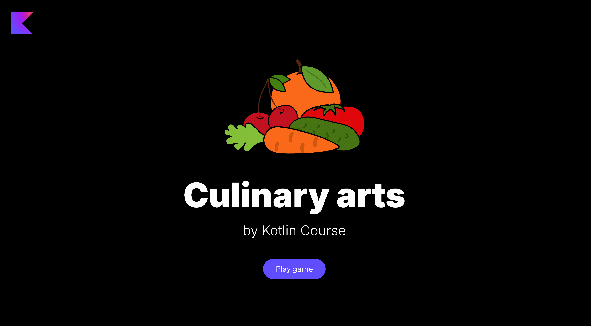

Let's practice! Let's start with the familiar approach with collections cook the tomato soup from the previous lesson with a _list_ of tomatoes.
In this task we will make the `Soup` button live.

In this task, you need to implement two functions in the `TomatoSoup.kt` file:

- `getTomatoesForSoup` - which get `NUMBER_OF_TOMATOES` tomatoes from the _fridge_ (a `VegetableType` with type `VegetableType.Tomato`), see `FridgeImpl` class to find the nessesary API
- `prepareTomatoes` - that accept a _list_ of tomatoes, and do the following with each item from the list:

  - put it into the kitchen (see `KitchenImpl.put`)
  - cut each element (see `KitchenImpl.cut`)
  - take each cut tomato (see `KitchenImpl.take`)
  - put each tomato into the pot (see `PotImpl.put`)

**Note:** If you do not have enough tomatoes in the fridge, please press the `Refill` button on the application to refill the fridge to be able to cook the tomato soup.

<div class="hint" title="Click me to view the expected state of the application after completing this task">



</div>

If you have any difficulties, **hints will help you solve this task**.

----

### Hints

<div class="hint" title="Click me to learn how to use API functions">

The game has the `GameEnviroment.kt` file which contains _instances_ of all possible objects, e.g.
it has `kitchen` variable for `KitchenImpl` and to use `KitchenImpl` API you need to call it with `kitchen`:
```kotlin
kitchen.put(...)
```
</div>

