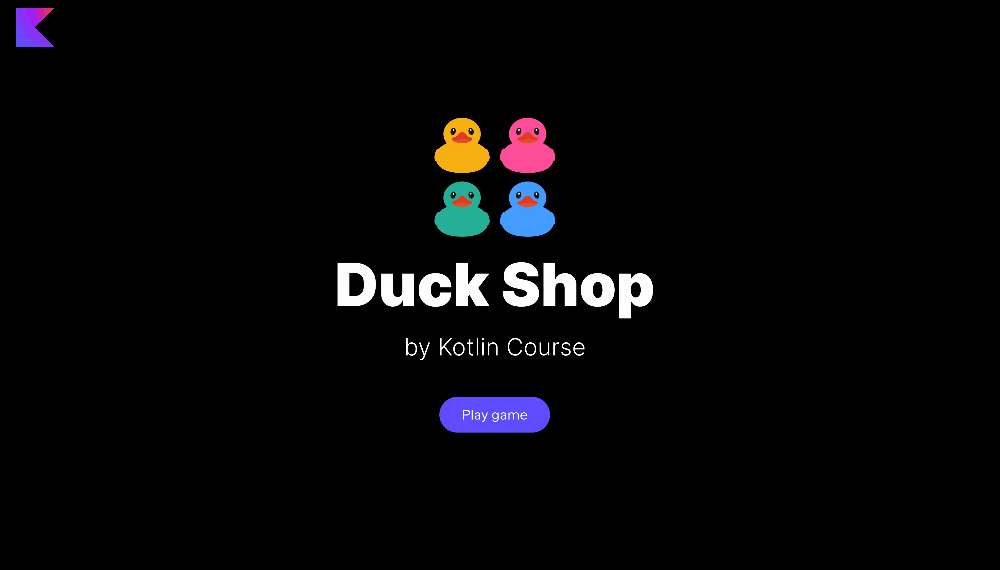

In this task, you need to implement a
function to be able to initialize a map of random ducks in the Duck Shop.

### Task

Implement the `generateMapOfDucks` function from the `GameModeService` class in
the `org.jetbrains.kotlin.course.duck.shop.mode` package.
This function should generate a new map with `MAX_NUMBER_OF_DUCKS` random ducks. 
For the value of each duck, you need to use the `getDescription` function from the `Duck.kt` file.

You can find the already defined variable `MAX_NUMBER_OF_DUCKS`
in the `GameUtil.kt` file in the `org.jetbrains.kotlin.course.duck.shop.utils` package.

After implementing this task, the `Map` button becomes alive.

<div class="hint" title="Click me to view the expected state of the application after completing this task">



</div>

If you have any difficulties, **hints will help you solve this task**.

----

### Hints

<div class="hint" title="Click me to learn how to create a map from a list">

You can use the built-in [`associateWith`](https://kotlinlang.org/api/latest/jvm/stdlib/kotlin.collections/associate-with.html) function to associate each item from the collection with a value and create a map:

```kotlin
val l = listOf("cat", "dog", "rabbit")
val m = l.associateWith { it.length } // The map {"cat": 3, "dog": 3, "rabbit": 6} will be created
```
</div>
