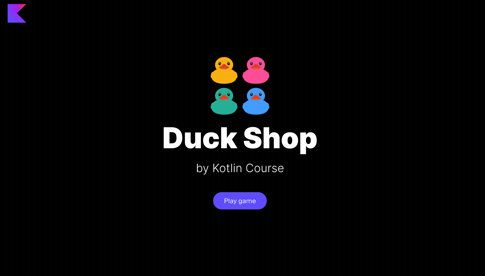

In this task, you need to implement a function
to be able to initialize a set of random ducks in the Duck Shop.

### Task

Implement the `generateSetOfDucks` function from the `GameModeService` class in
the `org.jetbrains.kotlin.course.duck.shop.mode` package.
This function should generate a new set with `MAX_NUMBER_OF_DUCKS` random ducks.

You can find the already defined variable `MAX_NUMBER_OF_DUCKS`
in the `GameUtil.kt` file in the `org.jetbrains.kotlin.course.duck.shop.utils` package.

After implementing this task, the `Set` button becomes alive.

If you have any difficulties, **hints will help you solve this task**.

----

### Hints

If you need to shuffle a list of elements, you can use the built-in function [`shuffled`](https://kotlinlang.org/api/latest/jvm/stdlib/kotlin.collections/shuffled.html).

To get the first `N` elements of the list, you can use the built-in [`take`](https://kotlinlang.org/api/latest/jvm/stdlib/kotlin.collections/take.html) function.
Note, since `List` is an ordered structure, you will always get the first `N` elements.
To complete the task, you can take the necessary number of shuffled elements and convert the result into a set.
Since the `Duck` enum has only different values, the resulting size of the set will be the same as the list size.

You can use the built-in function [`toSet`](https://kotlinlang.org/api/latest/jvm/stdlib/kotlin.collections/to-set.html) to convert a list to a set.

