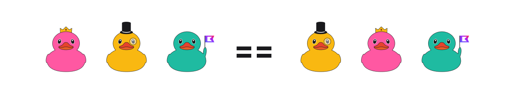
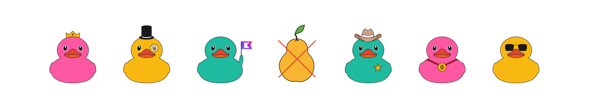
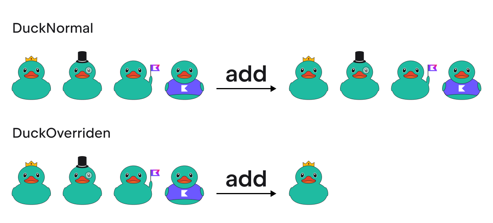

## Definition

`Sets` are collections of _unique_ elements. 
They reflect the mathematical abstraction of `Set`: 
a group of objects without duplicates.
It means, if we have two sets of the same size with the same objects inside, 
these two sets will be equal.



<div class="hint" title="Different Set implementations">

Unlike `List`, `Set` normally does not preserve the order of items.
But similar to the case of `List`, you can use different `Set` implementations to change this property:
e.g., you can use the `LinkedHashSet` implementation, which sorts elements in the set by default.

Each implementation defines not only the set of possible operations with this collection
but also the complexity of _this_ operation.
`LinkedHashSet`, for the intents and purposes of being accessed using `contains`, is simply 
a hash set. So, inserting elements into the linked hash set is cheap.
</div>

In general, `Set` contains _only_ elements with the _same_ type.
In some cases, it is possible to store elements with different types,
but they must have a _relation_ between them, see the [documentation](https://kotlinlang.org/docs/generics.html) for more details.



If you have a set with objects, e.g., with your own type like `Duck`, 
it is possible to override the behavior of comparing elements in `Set`.
By default, to compare elements inside a set, the [`equals`](https://kotlinlang.org/docs/equality.html) function is used.
It is possible to override this function and compare items only by a part of possible properties.

<div class="hint" title="Click me to see an example of comparing items in Set only by a part of possible properties">

Consider an example.

Let's have a `DuckNormal` class with several attributes:
```kotlin
data class DuckNormal(val backgroundColor: String, val accessories: List<String>)
```

Let's override the `equals` and `hashCode` methods to compare only `backgroundColor`:
```kotlin
data class DuckOverridden(val backgroundColor: String, val accessories: List<String>) {
    override fun equals(other: Any?) = backgroundColor == (other as? DuckOverridden)?.backgroundColor
  
    override fun hashCode() = backgroundColor.hashCode()
}
```

In this case, `DuckNormal` will be compared by `backgroundColor` and `accessories`, 
but `DuckOverridden` will be compared _only_ by `backgroundColor`:



Since we compare only `backgroundColor`, the set in the second case consists only of one element.

</div>

## Initialization

To create a new set, you can use special _builders_:

```kotlin
val emptySet1 = emptySet<Int>() // Builds the internal object EmptySet
val emptySet2 = setOf<Int>() // Calls emptySet()
```

<div class="hint" title="Click me to learn the difference between an emptySet and a standard set">

In Kotlin, the `emptySet` implementation is an object under the hood.
The main reason such a function exists is to save allocations (creating and deleting new variables).
Since `emptySet` returns the same _singleton_ instance every time it is called, one can
use it in an allocation-free manner. It allows your Kotlin program to work in a more efficient way.
</div>

```kotlin
val setWithNumbers = setOf(1, 2, 3) // The type can be inferred, a set with elements 1, 2, 3 will be created
```
