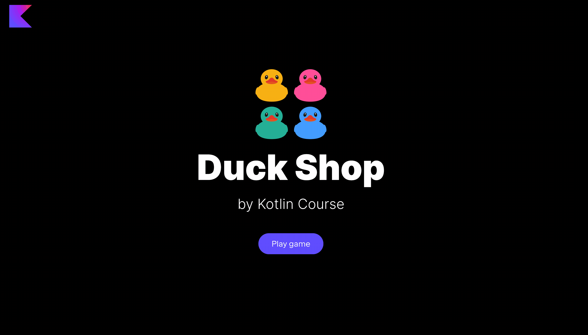

In this task, you need to implement functions to be able to
add ducks to the Duck Shop.

### Task

Implement three versions of the `addRandomDuck` function from the `GameChangeFunctionsService` class in
the `org.jetbrains.kotlin.course.duck.shop.functions.change` package.
These functions should add a random duck from a list, set, or a map.

Note, you need to _actually_ add a new duck, which means that in the cases with a set and a map, you 
need to generate a duck that is not present in the collection and add it.

After implementing this task, the `Add` button in all three modes becomes alive.

<div class="hint" title="Click me to view the expected state of the application after completing this task">



</div>

If you have any difficulties, **hints will help you solve this task**.

----

### Hints

<div class="hint" title="Click me to learn how to add a new item to a list or set">

To add a new item, you can use the built-in `add` function:
```kotlin
val listOfNumbers = mutableListOf(1, 2, 3)
listOfNumbers.add(4)
println(listOfNumbers) // 1, 2, 3, 4

val setOfNumbers = mutableSetOf(1, 2, 3)
setOfNumbers.add(4)
println(setOfNumbers) // 1, 2, 3, 4
```

Note that if you try to add the _same_ element to the set, it will not be added.
</div>

<div class="hint" title="Click me to learn how to add a new item to a map">

You can associate a new key with a new value:
```kotlin
val mapOfNumbers = mutableMapOf(1 to "one", 2 to "two")
mapOfNumbers[3] = "three"
println(mapOfNumbers) // 1 to "one", 2 to "two", 3 to "three"
```

In this case, if you try to use an existing key, the old key will be replaced with the new one.

If you need to put something only if it is absent, you can use the built-in `putIfAbsent` function:
```kotlin
val mapOfNumbers = mutableMapOf(1 to "one", 2 to "two")
mapOfNumbers.putIfAbsent(3, "three")
mapOfNumbers.putIfAbsent(3, "three") // Will not be added
println(mapOfNumbers) // 1 to "one", 2 to "two", 3 to "three"
```
</div>

<div class="hint" title="Click me to learn how to find the difference between two lists">

You can use the built-in `minus` function to make the call more efficient and convert one of the arguments of the set:
```kotlin
val listOfNumbers1 = listOf(1, 2, 3, 4, 5)
val listOfNumbers2 = listOf(1, 2, 3)
println(listOfNumbers1.minus(listOfNumbers2.toSet())) // 4, 5
```

The `minus` function can work with collections, it means the code `listOfNumbers1.minus(listOfNumbers2)` is also valid, 
but for better performance you need to convert a list to a set to work with fewer elements.
</div>
