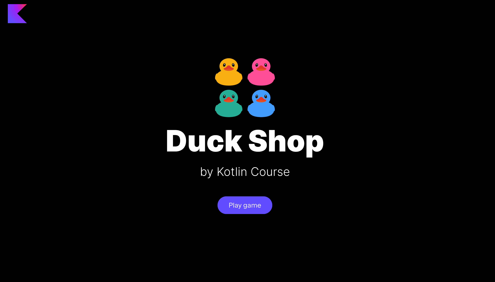

In this task, you need to implement functions to be able to
filter ducks to the Duck Shop and keep only the ducks with some Kotlin-related stuff.

### Task

Implement two versions of the `deleteDucksWithoutKotlinStuff` function from the `GameActionFunctionsService` class in
the `org.jetbrains.kotlin.course.duck.shop.functions.action` package.
These functions should keep only the ducks with some Kotlin-related stuff (the field `hasKotlinAttribute` is `true`).

We have only two functions, since the function `fun Collection<Duck>.deleteDucksWithoutKotlinStuff()` works for both collections — for `List` and for `Set`.

After implementing this task, the `Filter` button in all three modes becomes alive.

<div class="hint" title="Click me to view the expected state of the application after completing this task">



</div>

If you have any difficulties, **hints will help you solve this task**.

----

### Hints

<div class="hint" title="Click me to learn how to filter items in a list or a set">

To filter elements in a list or a set, you can use the built-in function [`filter`](https://kotlinlang.org/api/latest/jvm/stdlib/kotlin.collections/filter.html) 
to pass a function condition:
```kotlin
val listOfNumbers = listOf(1, 2, 3, 4, 5)
println(listOfNumbers.filter { it % 2 == 0 }) // 2, 4
```

You can also introduce a name for the elements instead of using `it`:
```kotlin
val listOfNumbers = listOf(1, 2, 3, 4, 5)
println(listOfNumbers.filter { number -> number % 2 == 0 }) // 2, 4
```
</div>

<div class="hint" title="Click me to learn how to filter items in a map">

You can also use the built-in function [`filter`](https://kotlinlang.org/api/latest/jvm/stdlib/kotlin.collections/filter.html) to filter elements in a map:
```kotlin
val mapOfNumbers = mapOf(1 to "one", 2 to "two", 3 to "three")
println(mapOfNumbers.filter { (key, value) -> key % 2 != 0 && value.length > 3 }) // 3 to "three"
```

If you need to filter a map _only_ by keys or values, you can use the [filterKeys](https://kotlinlang.org/api/latest/jvm/stdlib/kotlin.collections/filter-keys.html#filterkeys) 
and [filterValues](https://kotlinlang.org/api/latest/jvm/stdlib/kotlin.collections/filter-values.html#filtervalues) functions:

```kotlin
val mapOfNumbers = mapOf(1 to "one", 2 to "two", 3 to "three")
println(mapOfNumbers.filterKeys { it % 2 != 0 }) // 1 to "one", 3 to "three"
// OR
println(mapOfNumbers.filterKeys { key -> key % 2 != 0 }) // 1 to "one", 3 to "three"

println(mapOfNumbers.filterValues { it.length > 3 }) // 3 to "three"
// OR
println(mapOfNumbers.filterValues { value -> value.length > 3 }) // 3 to "three"
```
</div>

