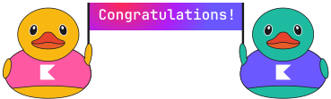

Congratulations! You did a great job and created a working application.
We have put together a few ideas on how you could further improve this project on your own.
These improvements will not be assessed as part of the course.
Some of them may require changes to both the client side (what is displayed in the browser)
and the server side (the application logic).
As we don't cover the client-server architecture in this course,
so you can either explore it on your own or implement ideas that don't require investigating third-party code.

**Server improvements:**

- Currently, the ducks are hardcoded into the `Duck` enum class.
  As an enhancement, you could generate different kinds of ducks.
- You could add more complex logic for adding, removing, or shuffling ducks.
- At present, we lose the application state if we turn off the server.
  You could implement a feature to save the current state of the duck shop in files,
  allowing the data to be retrieved when the server starts up.

**Client improvements:**

- To properly display generated ducks, you might want to improve the client logic and, for instance, generate
a duck picture based on the duck's properties, such as its color or accessories.
- You could also animate the duck shop by adding animations for all actions.

    

