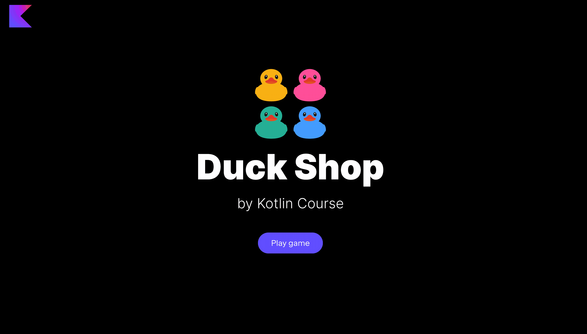

Let's start with our first project!

### Project description

The project of this lesson is **Duck shop**.
As you know, many programmers ask rubber ducks for [help](https://en.wikipedia.org/wiki/Rubber_duck_debugging).
The main goal of this project is to implement a shop window with rubber duckies 
and study `List`, `Set`, and `Map` collections.

### Lesson topics

- definitions of `List`, `Set`, and `Map` collections;
- read-only and mutable collections with `add` and `remove` operations;
- built-in functions to work with collections:

  - `filter`, `partition`, `shuffled`, `sort`

### Project example

By the end of this task, you will create the following application:

