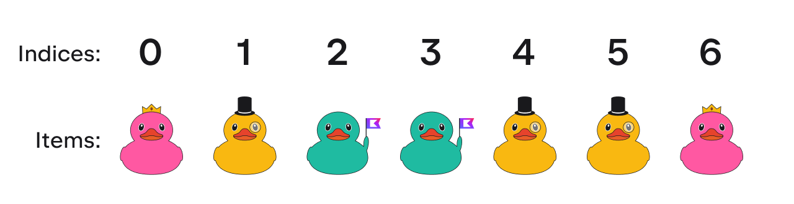
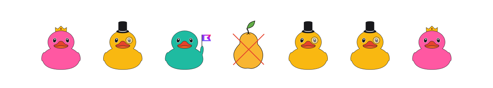

## Definition

A collection usually contains a number of objects 
(this number may also be zero) of the same type.  
Objects in a collection are called elements or items.  

`Lists` are ordered collections with access to 
elements by indices — integer numbers that reflect their position. 
The index of the first element is zero.
Elements can occur more than once in a list.



<div class="hint" title="Click me to read about different List implementations">

  `List` may be implemented using an array or a doubly linked list internally. 
  We could say that `List` is an interface or specification determining which operations are supported 
  (for example, insert item, remove item, get item by index, etc.)
  and this interface can be backed by multiple implementations.

  Each implementation defines not only the set of possible operations with the collection 
  but also the complexity of _this_ operation. 

  By default, `ArrayList` is built. `ArrayList` is an array-based implementation. 
  It is cheap in terms of reading (finding an item) and, generally, adding items, but it is expensive as regards injecting or removing objects.
  You can also use a `LinkedList` implementation from Java if you work with Kotlin under the JVM.
  A linked list is composed of nodes that are connected with each other using pointers.
  The insertion and deletion operations are efficient, but to find a node at position n, 
  you have to start the search at the first node in the linked list, following the path 
  of references n times.
</div>

In general, `List` contains _only_ elements with the _same_ type. 
In some cases, it is possible to store elements with different types, 
but they must have a _relation_ between them, see the [documentation](https://kotlinlang.org/docs/generics.html) for more details.



## Initialization

To create a new list, you can use special _builders_:

```kotlin
val emptyList1 = emptyList<Int>() // Builds the internal object EmptyList
val emptyList2 = listOf<Int>() // Calls emptyList()
```

<div class="hint" title="Click me to learn the difference between an emptyList and a standard list">

In Kotlin, the `emptyList` implementation is an object under the hood.
The main reason such a function exists is to save allocations (creating and deleting new variables).
Since `emptyList` returns the same _singleton_ instance every time it is called, one can 
use it in an allocation-free manner. It allows to work your Kotlin program to work in a more efficient way.
</div>

```kotlin
val listWithNumbers1 = listOf(1, 2, 3) // The type can be inferred, a list with elements 1, 2, 3 will be created
```

In some cases, you need to create a list with `N` elements 
where each element will be generated via a special function. 
In such a case, you can use the `List` constructor and pass the number of elements and 
the function that generates these elements. This function will be called `N` times to fill out the list with `N` elements:

```kotlin
fun generateRandomInt(): Int = TODO("Not implemented yet")

val listWithNumbers2 = List(3) { generateRandomInt() } // A list with three random integer numbers will be created
```
