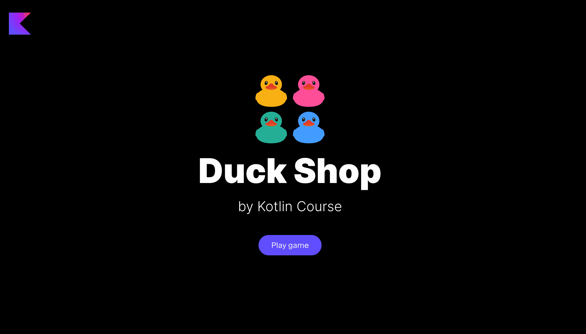

In this task, you need to implement a function to be able to
divide ducks in the Duck Shop into two categories — those with some Kotlin-related stuff and those without it — and reorder them according to this condition.

### Task

Implement the `divideDucksIntoKotlinAndNonKotlin` function from the `GameActionFunctionsService` class in
the `org.jetbrains.kotlin.course.duck.shop.functions.action` package.
This function should divide ducks into two groups — those with some Kotlin attribute (the field `hasKotlinAttribute` is `true`) and those without it — and return these two collections.

We have only one function, since the function `fun Collection<Duck>.divideDucksIntoKotlinAndNonKotlin()` works for both collections — for `List` and for `Set`.
The map collection does not have this function.

After implementing this task, the `Partition` button in `list` and `set` modes becomes alive.

<div class="hint" title="Click me to view the expected state of the application after completing this task">



</div>

If you have any difficulties, **hints will help you solve this task**.

----

### Hints

<div class="hint" title="Click me to learn how to divide a collection based on a condition">

You can do it in several ways, but the easiest one is to use the built-in [`partition`](https://kotlinlang.org/api/latest/jvm/stdlib/kotlin.collections/partition.html) function.
It accepts a predicate (condition) to divide a collection into two parts according to this condition:

```kotlin
val listOfNumbers = listOf(1, 2, 3, 4, 5, 6)
println(listOfNumbers.partition { it % 2 == 0 }) // Returns a pair of two lists: [2, 4, 6], [1, 3, 5]
```
</div>
