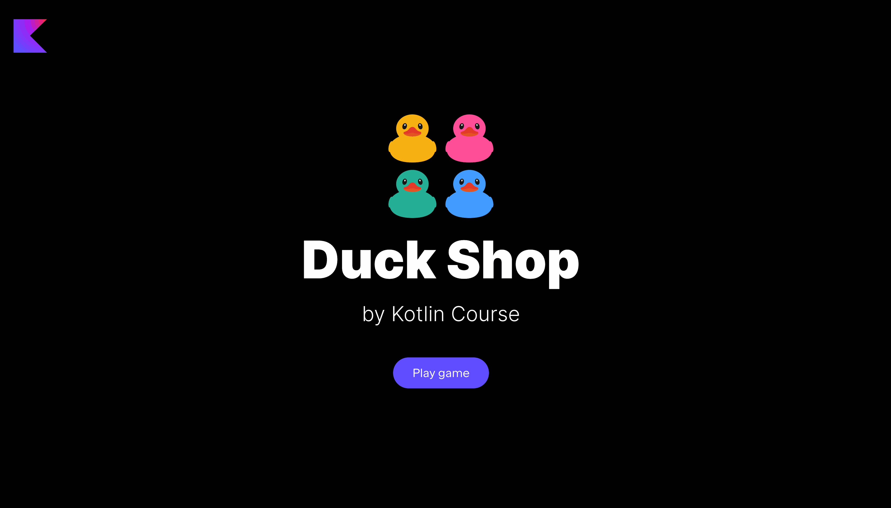

In this task, you need to implement functions to be able to 
remove ducks from the Duck Shop.

### Task

Implement three versions of the `removeRandomDuck` function from the `GameChangeFunctionsService` class in
the `org.jetbrains.kotlin.course.duck.shop.functions.change` package.
These functions should remove a random duck from a list, set, or map.

After implementing this task, the `Remove` button in all three modes becomes alive.

<div class="hint" title="Click me to view the expected state of the application after completing this task">



</div>

If you have any difficulties, **hints will help you solve this task**.

----

### Hints

<div class="hint" title="Click me to learn what extension functions are">

  The `removeRandomDuck` functions are implemented as [extension](https://kotlinlang.org/docs/extensions.html#extension-functions) functions.
  These functions allow you to extend _any_ class with your own functionality, e.g.,

```kotlin
fun List<Duck>.removeRandomDuck(): List<Duck> = TODO("Not implemented yet")
```
is the same as
```kotlin
fun removeRandomDuck(listOfDucks: List<Duck>): List<Duck> = TODO("Not implemented yet")
```
However, in the first example, you can call the `removeRandomDuck` function directly from the list of ducks, e.g.,
```kotlin
myList.removeRandomDuck()
```
In the second one, you need to pass the list as an argument:
```kotlin
removeRandomDuck(myList)
```
</div>


 <div class="hint" title="Click me to learn how to convert a collection to a mutable one">

You can use the built-in `toMutableList`, `toMutableSet`, and `toMutableMap` functions:
```kotlin
fun main() {
    val listOfNumbers = listOf(1, 2, 3)
    val mutableListOfNumbers = listOfNumbers.toMutableList()

    val setOfNumbers = setOf(1, 2, 3)
    val mutableSetOfNumbers = setOfNumbers.toMutableSet()

    val mapOfNumbers = mapOf(1 to "one", 2 to "two")
    val mutableMapOfNumbers = mapOfNumbers.toMutableMap()
}
```
 </div>

<div class="hint" title="Click me to learn how to generate a random element from a list or a set">

You can use different built-in functions. The first way to generate a random element from a list 
is to generate a random index and get the element with this index from the list:
```kotlin
val listOfNumbers = listOf(1, 2, 3)
println(listOfNumbers[listOfNumbers.indices.random()])
```

The second way is shorter, since you can generate a random element directly from a collection:
```kotlin
val listOfNumbers = listOf(1, 2, 3)
println(listOfNumbers.random())

val mapOfNumbers = mapOf(1 to "one", 2 to "two")
println(mapOfNumbers[mapOfNumbers.keys.random()])
```
</div>

<div class="hint" title="Click me to learn how to generate a random element from a map">

Since in a map you have keys and values, you can apply the `random` function to the list of keys to
generate a random key and next to get a value for this key:
```kotlin
val mapOfNumbers = mapOf(1 to "one", 2 to "two")
println(mapOfNumbers[mapOfNumbers.keys.random()])
```
</div>

<div class="hint" title="Click me to learn how to remove an element from a list, set, or map">

You can use different built-in functions to delete elements from collections.
The first way is to delete an element from a list _by index_:
```kotlin
val listOfNumbers = mutableListOf(1, 2, 3)
listOfNumbers.removeAt(0)
println(listOfNumbers) // 2, 3
```

You cannot invoke this function with a set or a map, since those are unordered collections.

The second way is valid for all three types of collections – you can delete an element 
directly via the built-in `remove` function:
```kotlin
    val listOfNumbers = mutableListOf(1, 2, 3)
listOfNumbers.remove(2) // Remove item: 2

val mapOfNumbers = mutableMapOf(1 to "one", 2 to "two")
mapOfNumbers.remove(1) // Remove item: 1 to "one"
```
</div>


 
