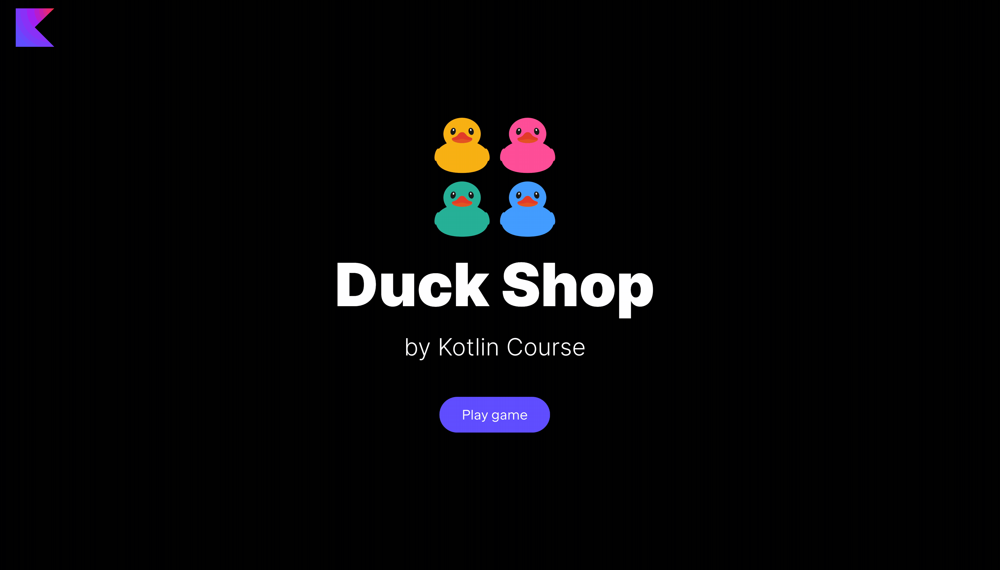

In this task, you need to implement a function to be able to
shuffle ducks in the Duck Shop in a random order.

### Task

Implement the `shuffleDucks` function from the `GameActionFunctionsService` class in
the `org.jetbrains.kotlin.course.duck.shop.functions.action` package.
This function should shuffle a list of ducks in a random order.

We have only one function – for `list`, since only `list` is an ordered collection by default.

After implementing this task, the `Shuffle` button in the `list` mode becomes alive.

<div class="hint" title="Click me to view the expected state of the application after completing this task">



</div>

If you have any difficulties, **hints will help you solve this task**.

----

### Hints

<div class="hint" title="Click me to learn how to shuffle a list of items">

You can use the built-in [`shuffled`](https://kotlinlang.org/api/latest/jvm/stdlib/kotlin.collections/shuffled.html) function:
```kotlin
val listOfNumbers = listOf(1, 2, 3, 4)
println(listOfNumbers.shuffled()) // The list with 1, 2, 3, 4 elements in a random order
```
</div>
