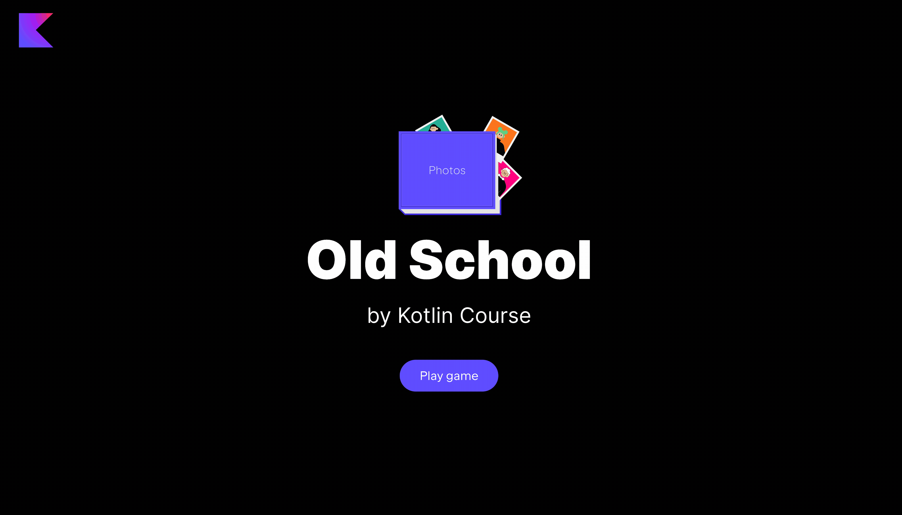

It's time for coding! The first task is to implement the `getAllPossibleColors` 
method in `GameFunctionsService`, which is already defined in the `org.jetbrains.kotlin.course.old.school.functions` 
package in the `GameFunctionsService.kt` file.

This function should return lowercase names of all _entities_ of the `Color` enum class from the `org.jetbrains.kotlin.course.old.school.photo` package.

After implementing this task, the list of possible colors will be non-empty.

<div class="hint" title="Click me to view the expected state of the application after completing this task">



</div>

If you have any difficulties, **hints will help you solve this task**.

----

### Hints

<div class="hint" title="Click me to learn how to get all values from an enum class">

To get all values from an enum class, you can use the built-in property [`entries`](https://kotlinlang.org/docs/enum-classes.html#working-with-enum-constants):
```kotlin
val allColors = Color.entries
```
</div>

<div class="hint" title="Click me to learn how to name an enum entry">

You can use the `name` property:
```kotlin
enum class Color {
    White,
    Blue,
    ;
}

fun main() {
    Color.entries.forEach{ println(it.name) } // White, Blue
}
```
</div>

<div class="hint" title="Click me to learn how to lowercase a string">

You can use the built-in function [`lowercase`](https://kotlinlang.org/api/latest/jvm/stdlib/kotlin.text/lowercase.html):
```kotlin
fun main() {
    println("Name".lowercase()) // name
}
```
</div>
