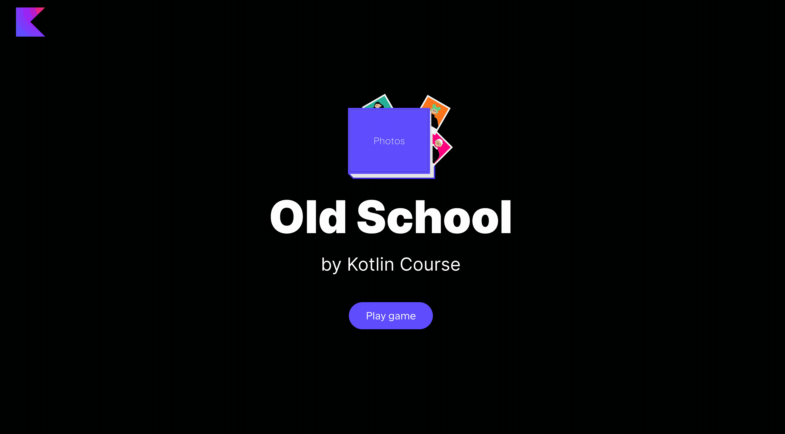

Here's another exercise with the `groupBy` function.
Implement the `groupPhotosByHairAndHat` function from the `GameFunctionsService` class.
This function should group photos by the hair type, 
then group photos by the presence of hats in each hair type group, 
and then return the flattened list of all grouped photos, e.g.:
```kotlin
fun main() {
    val photos = listOf(
        "olivia", // HairType.Dark; no hat
        "daniel", // HairType.Dark; with hat
        "emma", // HairType.Light, no hat
        "henry", // HairType.Dark; no hat
        "noah", // HairType.Dark; with hat
        "oliver", // HairType.Light, with hat
        "diana" // HairType.Light, no hat
    )

    println(photos.groupPhotosByHairAndHat())
    // First of all we group photos by hair type:
    // - HairType.Dark: Olivia, Daniel, Henry, Noah
    // - HairType.Light: Emma, Oliver, Diana
    // Next, within each resulting group, we group by hat presence:
    // - HairType.Dark:
    //      - No hat: Olivia, Henry
    //      - With hat: Daniel, Noah
    // - HairType.Light:
    //      - No hat: Emma, Diana
    //      - With hat: Oliver
    //
    // Finally, we simply flatten the resulting groups.
    // So, the final flatted output is:
    // [Olivia, Henry, Daniel, Noah, Emma, Diana, Oliver]
}
```

You can use the already implemented function `toPhotoCharacters` to implement the `groupPhotosByHairAndHat` function.

After implementing this task, you will be able to group photos by the hair type and hat presence and reorder them in the album.

<div class="hint" title="Click me to view the expected state of the application after completing this task">



</div>
