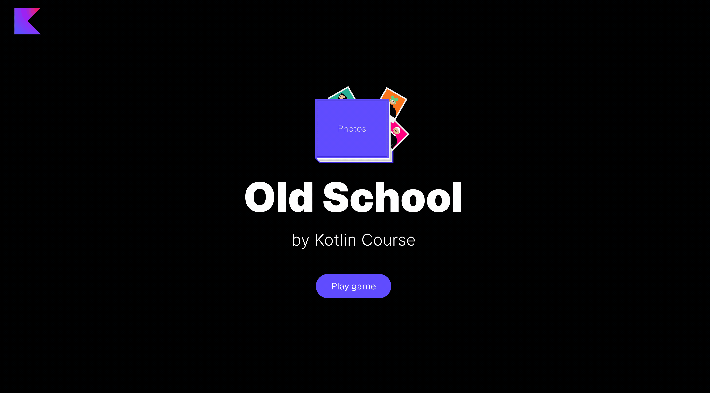

It's time to practice with the `groupBy` function. 
Implement the `groupPhotosByColor` function from the `GameFunctionsService` class.
This function should group photos by the background colour and then return 
the flattened list of grouped photos, e.g.:
```kotlin
fun main() {
    val photos = listOf(
        "olivia", // Purple
        "larry", // Orange
        "david", // Gray
        "daniel", // Purple
        "diana" // Orange
    )

    println(photos.groupPhotosByColor())
    // Groups by colors and then builds a flattened 
    // list with the values for each color: 
    // - Purple: Olivia, Daniel
    // - Orange: Larry, Diana
    // - Gray: David
    //
    // So, the final flattened output is:
    // [Olivia, Daniel, Larry, Diana, David]
}
```

You can use the already implemented function `toPhotoCharacters` to implement the `groupPhotosByColor` function.

After completing this task, you will be able to group photos by color and reorder them in the album

<div class="hint" title="Click me to view the expected state of the application after completing this task">



</div>

If you have any difficulties, **hints will help you solve this task**.

----

### Hints

<div class="hint" title="Click me to learn how to flatten a list of lists">

The easiest way to do this is to use the built-in [`flatten`](https://kotlinlang.org/api/latest/jvm/stdlib/kotlin.collections/flatten.html) function:
```kotlin
fun main() {
    val photos = listOf(
        listOf("olivia", "daniel"),
        listOf("larry", "diana"),
        listOf("david"),
    )

    println(photos.flatten()) // [olivia, daniel, larry, diana, david]
}
```

Also, if you work with a map where values are lists and you need to get the values and flatten them into one list,
you can use the built-in [`flatMap`](https://kotlinlang.org/api/latest/jvm/stdlib/kotlin.collections/flat-map.html) function:
```kotlin
fun main() {
    val photos = mapOf(
        1 to listOf("olivia", "daniel"),
        2 to listOf("larry", "diana"),
        3 to listOf("david"),
    )

    println(photos.map { it.value }.flatten()) // [olivia, daniel, larry, diana, david]
    // is the same with 
    println(photos.flatMap { it.value }) // [olivia, daniel, larry, diana, david]
}
```
</div>
