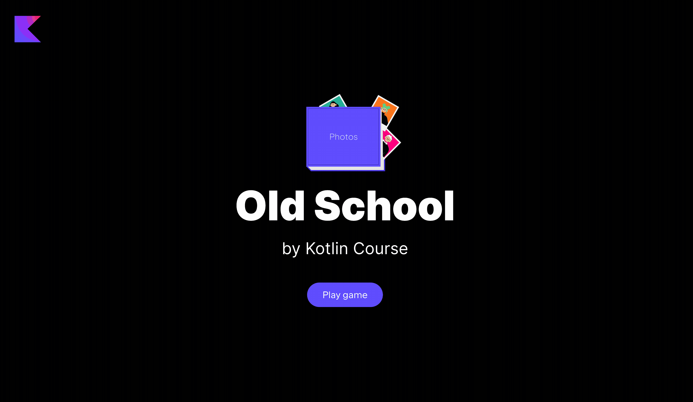

### Project description

The project of this lesson is **Old school**.
Nowadays, taking Polaroid photos is a common hobby, 
and most photos are stored electronically. 
In the past, however, that was an almost inaccessible way to preserve 
the memories of important moments.
The main goal of this project is to go back in time and 
implement several `List`, `Set`, and `Map` functions, which will allow you to navigate through your photo album.

### Lesson topics

- finding items in collections
- grouping elements in collections

### Project example

By the end of this task, you will create the following application:

